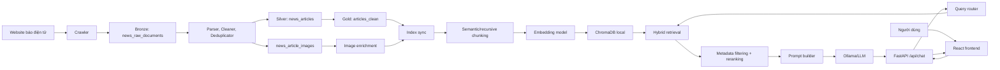

# BÁO CÁO ĐỒ ÁN CUỐI KỲ

## Đề tài: Xây dựng hệ thống News AI/RAG hỗ trợ hỏi đáp thông tin báo điện tử tiếng Việt

**Khoa:** Công nghệ Thông tin  
**Trường:** Trường Đại học Công nghiệp TP.HCM  
**Học phần:** Điện toán đám mây  
**Giảng viên hướng dẫn:** ThS. Nguyễn Thị Minh  
**Sinh viên thực hiện:** Nguyễn Đức Hùng  
**Mã số sinh viên:** 21012345  
**Lớp:** DHKH17A  
**Thời gian thực hiện:** Học kỳ II, Năm học 2025 - 2026

---

## LỜI CẢM ƠN

Em xin chân thành cảm ơn Khoa Công nghệ Thông tin, Trường Đại học Công nghiệp TP.HCM đã tạo điều kiện học tập và nghiên cứu trong quá trình thực hiện đồ án. Em cũng xin gửi lời cảm ơn đến giảng viên hướng dẫn đã hỗ trợ, định hướng và góp ý để em có thể hoàn thiện đề tài theo hướng thực tiễn hơn.

Trong quá trình thực hiện, em đã có cơ hội vận dụng các kiến thức về xử lý ngôn ngữ tự nhiên, hệ thống dữ liệu, lập trình backend, frontend và mô hình hỏi đáp dựa trên truy hồi. Do giới hạn về thời gian và nguồn lực, báo cáo khó tránh khỏi thiếu sót. Em mong nhận được các ý kiến đóng góp để tiếp tục hoàn thiện hệ thống trong các giai đoạn sau.

## LỜI CAM ĐOAN

Em xin cam đoan báo cáo đồ án với đề tài "Xây dựng hệ thống News AI/RAG hỗ trợ hỏi đáp thông tin báo điện tử tiếng Việt" là kết quả nghiên cứu và thực hiện của bản thân/nhóm dưới sự hướng dẫn của giảng viên phụ trách. Các nội dung trình bày trong báo cáo được tổng hợp từ quá trình xây dựng hệ thống, phân tích mã nguồn, tài liệu kỹ thuật và các nguồn tham khảo được liệt kê ở cuối báo cáo.

Các số liệu thực nghiệm chưa được đo đạc đầy đủ được trình bày dưới dạng placeholder để bổ sung sau khi chạy hệ thống trên tập dữ liệu thực tế. Em cam kết không sao chép nguyên văn kết quả của người khác và chịu trách nhiệm về tính trung thực của nội dung báo cáo.

## TÓM TẮT

Sự phát triển nhanh của báo điện tử tiếng Việt tạo ra một lượng lớn thông tin được cập nhật liên tục mỗi ngày. Người dùng thường gặp khó khăn khi cần tổng hợp tin tức từ nhiều nguồn, tìm lại bài viết liên quan, hoặc đặt các câu hỏi có tính ngữ nghĩa thay vì chỉ tìm kiếm bằng từ khóa. Trong bối cảnh đó, đề tài xây dựng một hệ thống News AI/RAG nhằm hỗ trợ hỏi đáp thông tin từ báo điện tử tiếng Việt, kết hợp pipeline dữ liệu trên Databricks, Delta Lake, ChromaDB, FastAPI, React và mô hình ngôn ngữ lớn chạy cục bộ thông qua Ollama.

Mục tiêu của hệ thống là thu thập dữ liệu từ các nguồn báo như VNExpress, CafeF, GenK và Diễn đàn Doanh nghiệp; xử lý dữ liệu qua các bước parse HTML, chuẩn hóa URL, làm sạch nội dung, khử trùng lặp, phân loại chủ đề, trích xuất thực thể và ảnh bài viết; sau đó xây dựng một lớp truy hồi phục vụ hỏi đáp. Kiến trúc dữ liệu được tổ chức theo mô hình Lakehouse với các tầng Bronze, Silver và Gold. Trong đó, bảng Delta `main.news_ai.articles_clean` đóng vai trò nguồn dữ liệu tin cậy, còn ChromaDB được sử dụng như một vector index cục bộ để phục vụ semantic search và hybrid search.

Phương pháp đề xuất kết hợp Retrieval-Augmented Generation với truy hồi hybrid giữa vector search và BM25. Hệ thống sử dụng query router để phân tích intent, chủ đề, thực thể, nguồn báo, khoảng thời gian, mã cổ phiếu và nhu cầu truy xuất ảnh. Metadata filtering và reranking được áp dụng nhằm cải thiện độ phù hợp của nguồn truy xuất. Backend FastAPI cung cấp API hỏi đáp, trong khi frontend React cung cấp giao diện chat và bộ lọc tương tác cho người dùng.

Kết quả đạt được là một kiến trúc hệ thống hoàn chỉnh ở mức prototype có khả năng thu thập, xử lý, lập chỉ mục và hỏi đáp dựa trên dữ liệu báo chí tiếng Việt. Hệ thống hỗ trợ câu trả lời kèm nguồn trích dẫn, truy vấn theo chủ đề, thực thể, nguồn, thời gian và ảnh liên quan. Tuy nhiên, hệ thống vẫn còn một số hạn chế như phụ thuộc vào chất lượng dữ liệu crawl, ChromaDB hiện chạy cục bộ, LLM local có thể chậm, và một số thành phần router/entity extraction còn dựa trên luật. Trong tương lai, hệ thống có thể mở rộng sang Databricks Vector Search, Model Serving, đánh giá tự động, caching, monitoring và dashboard quản trị dữ liệu.

## MỤC LỤC

- [Lời cảm ơn](#lời-cảm-ơn)
- [Lời cam đoan](#lời-cam-đoan)
- [Tóm tắt](#tóm-tắt)
- [Danh mục chữ viết tắt](#danh-mục-chữ-viết-tắt)
- [Danh mục hình vẽ](#danh-mục-hình-vẽ)
- [Danh mục bảng](#danh-mục-bảng)
- [Chương 1. Giới thiệu bài toán](#chương-1-giới-thiệu-bài-toán)
- [Chương 2. Cơ sở lý thuyết và phân tích yêu cầu](#chương-2-cơ-sở-lý-thuyết-và-phân-tích-yêu-cầu)
- [Chương 3. Phương pháp đề xuất và thiết kế hệ thống](#chương-3-phương-pháp-đề-xuất-và-thiết-kế-hệ-thống)
- [Chương 4. Thực nghiệm và đánh giá](#chương-4-thực-nghiệm-và-đánh-giá)
- [Chương 5. Kết luận và hướng phát triển](#chương-5-kết-luận-và-hướng-phát-triển)
- [Tài liệu tham khảo](#tài-liệu-tham-khảo)
- [Phụ lục](#phụ-lục)

## DANH MỤC CHỮ VIẾT TẮT

| Chữ viết tắt | Diễn giải |
|---|---|
| AI | Artificial Intelligence - Trí tuệ nhân tạo |
| API | Application Programming Interface - Giao diện lập trình ứng dụng |
| BM25 | Best Matching 25 - thuật toán truy hồi văn bản dựa trên từ khóa |
| ETL | Extract, Transform, Load - trích xuất, biến đổi và nạp dữ liệu |
| HTML | HyperText Markup Language - ngôn ngữ đánh dấu siêu văn bản |
| JSON | JavaScript Object Notation - định dạng trao đổi dữ liệu |
| LLM | Large Language Model - mô hình ngôn ngữ lớn |
| NLP | Natural Language Processing - xử lý ngôn ngữ tự nhiên |
| RAG | Retrieval-Augmented Generation - sinh câu trả lời tăng cường bằng truy hồi |
| SQL | Structured Query Language - ngôn ngữ truy vấn dữ liệu |
| UI | User Interface - giao diện người dùng |
| URL | Uniform Resource Locator - địa chỉ tài nguyên trên Internet |
| Delta Lake | Lớp lưu trữ dữ liệu hỗ trợ ACID transaction trên Data Lake |

## DANH MỤC HÌNH VẼ

| Mã hình | Tên hình |
|---|---|
| Hình 3.1 | Kiến trúc tổng quát hệ thống News AI/RAG |
| Hình 3.2 | Luồng xử lý dữ liệu từ website báo đến ChromaDB |
| Hình 3.3 | Luồng xử lý câu hỏi trong RAG backend |

## DANH MỤC BẢNG

| Mã bảng | Tên bảng |
|---|---|
| Bảng 2.1 | Yêu cầu chức năng của hệ thống |
| Bảng 2.2 | Yêu cầu phi chức năng của hệ thống |
| Bảng 3.1 | Mô tả các tầng dữ liệu Lakehouse |
| Bảng 3.2 | Nhóm chủ đề sử dụng trong hệ thống |
| Bảng 4.1 | Công nghệ sử dụng trong thực nghiệm |
| Bảng 4.2 | Kết quả xử lý dữ liệu |
| Bảng 4.3 | Bộ test case đánh giá RAG |
| Bảng 4.4 | So sánh vector search, BM25 và hybrid search |

# CHƯƠNG 1. GIỚI THIỆU BÀI TOÁN

## 1.1 Bối cảnh và lý do chọn đề tài

Báo điện tử là một trong những nguồn thông tin quan trọng đối với người dùng Internet. Mỗi ngày, các trang báo tiếng Việt liên tục xuất bản tin mới về nhiều lĩnh vực như kinh tế, chính trị, công nghệ, bất động sản, giáo dục, sức khỏe, giải trí và quốc tế. Khối lượng dữ liệu lớn và tốc độ cập nhật nhanh khiến việc tìm kiếm, tổng hợp và đối chiếu thông tin trở nên khó khăn, đặc biệt khi người dùng cần câu trả lời ngắn gọn, có nguồn dẫn và liên quan đến nhiều bài viết.

Các công cụ tìm kiếm truyền thống thường dựa nhiều vào từ khóa. Cách tiếp cận này hiệu quả khi người dùng biết chính xác từ khóa cần tìm, nhưng còn hạn chế với các câu hỏi tự nhiên như "tin AI mới nhất", "HPG có gì mới" hoặc "cho tôi ảnh liên quan Ukraine". Những câu hỏi này yêu cầu hệ thống hiểu ý định, nhận diện thực thể, lọc theo thời gian, phân loại chủ đề và truy hồi các bài viết phù hợp trước khi tạo câu trả lời.

Retrieval-Augmented Generation là phương pháp phù hợp cho bài toán trên vì kết hợp khả năng truy hồi tài liệu với khả năng sinh ngôn ngữ của LLM. Thay vì để LLM trả lời hoàn toàn từ tri thức nội tại, hệ thống truy xuất các bài báo liên quan từ kho dữ liệu đã được xử lý, sau đó cung cấp chúng làm ngữ cảnh cho mô hình sinh câu trả lời. Cách tiếp cận này giúp giảm rủi ro trả lời sai, tăng khả năng dẫn nguồn và cho phép cập nhật tri thức theo dữ liệu crawl mới.

Đề tài lựa chọn kiến trúc Lakehouse kết hợp RAG vì dữ liệu báo chí cần được quản lý có hệ thống qua nhiều bước: thu thập raw HTML, parse và làm sạch, khử trùng lặp, chuẩn hóa schema, sau đó lập chỉ mục phục vụ hỏi đáp. Delta Lake được sử dụng làm source of truth để đảm bảo dữ liệu có thể kiểm tra, tái xử lý và mở rộng; ChromaDB được sử dụng như vector store cục bộ để phục vụ truy hồi semantic nhanh trong giai đoạn prototype.

## 1.2 Mục tiêu đề tài

Đề tài hướng đến các mục tiêu chính sau:

- Xây dựng pipeline thu thập dữ liệu từ nhiều nguồn báo điện tử tiếng Việt.
- Thiết kế quy trình xử lý dữ liệu gồm parse HTML, làm sạch nội dung, chuẩn hóa URL, khử trùng lặp, phân loại chủ đề, trích xuất thực thể và ảnh.
- Tổ chức dữ liệu theo mô hình Lakehouse Bronze/Silver/Gold trên Databricks Delta Lake.
- Xây dựng cơ chế đồng bộ dữ liệu từ Gold table sang ChromaDB local.
- Áp dụng semantic/recursive chunking và embedding để lập chỉ mục nội dung bài viết.
- Thiết kế cơ chế truy hồi hybrid kết hợp vector search, BM25, metadata filtering và reranking.
- Xây dựng backend FastAPI cung cấp API hỏi đáp và frontend React phục vụ tương tác người dùng.
- Đánh giá khả năng trả lời có trích dẫn nguồn, lọc theo chủ đề, nguồn, thời gian, thực thể, mã cổ phiếu và ảnh liên quan.

## 1.3 Phạm vi đề tài

Phạm vi của đề tài tập trung vào hệ thống prototype phục vụ hỏi đáp trên dữ liệu báo điện tử tiếng Việt. Nguồn dữ liệu thử nghiệm gồm VNExpress, CafeF, GenK và Diễn đàn Doanh nghiệp. Hệ thống xử lý các bài viết dạng HTML, xây dựng bảng dữ liệu sạch, lập chỉ mục vector cục bộ và cung cấp API hỏi đáp.

Đề tài chưa tập trung vào các vấn đề triển khai ở quy mô sản xuất như tự động scale crawler, kiểm soát chi phí vận hành cloud, bảo mật đa người dùng, phân quyền chi tiết, giám sát realtime đầy đủ hoặc triển khai toàn bộ vector search/model serving trên Databricks. Các thành phần như entity extraction và query routing hiện vẫn kết hợp luật thủ công với metadata sẵn có.

## 1.4 Ý nghĩa của đề tài

Về mặt học thuật, đề tài giúp vận dụng các kiến thức về xử lý ngôn ngữ tự nhiên, hệ thống dữ liệu, truy hồi thông tin, mô hình ngôn ngữ lớn và thiết kế ứng dụng web. Về mặt thực tiễn, hệ thống có thể hỗ trợ người dùng tìm kiếm thông tin báo chí theo cách tự nhiên hơn, nhận câu trả lời ngắn gọn kèm nguồn tham khảo, đồng thời cho phép mở rộng thành nền tảng tổng hợp tin tức hoặc trợ lý phân tích truyền thông.

# CHƯƠNG 2. CƠ SỞ LÝ THUYẾT VÀ PHÂN TÍCH YÊU CẦU

## 2.1 Bài toán hỏi đáp trên dữ liệu báo chí

Bài toán hỏi đáp trên dữ liệu báo chí yêu cầu hệ thống tiếp nhận câu hỏi tự nhiên của người dùng, tìm các bài viết liên quan trong kho dữ liệu, tổng hợp thông tin và sinh câu trả lời có căn cứ. Khác với bài toán chatbot thông thường, hệ thống cần đảm bảo câu trả lời bám sát dữ liệu đã thu thập và có thể dẫn nguồn để người dùng kiểm chứng.

Đặc thù của dữ liệu báo chí là tính cập nhật, đa nguồn, đa chủ đề và nhiều định dạng HTML khác nhau. Một bài viết có thể chứa tiêu đề, mô tả ngắn, nội dung chính, ảnh, caption, tác giả, thời gian xuất bản và chuyên mục. Các nguồn báo khác nhau có cấu trúc HTML khác nhau, vì vậy hệ thống cần có crawler và parser riêng cho từng nguồn.

## 2.2 Tổng quan về NLP và LLM

Xử lý ngôn ngữ tự nhiên là lĩnh vực nghiên cứu các phương pháp giúp máy tính hiểu, phân tích và sinh ngôn ngữ của con người. Trong hệ thống này, NLP được sử dụng ở nhiều bước như làm sạch văn bản, phân tách nội dung, trích xuất thực thể, phân loại chủ đề, biểu diễn văn bản dưới dạng vector và xây dựng prompt cho mô hình ngôn ngữ.

LLM là các mô hình học sâu có khả năng sinh văn bản tự nhiên, tóm tắt, trả lời câu hỏi và suy luận trên ngữ cảnh được cung cấp. Tuy nhiên, nếu chỉ sử dụng LLM độc lập, mô hình có thể trả lời dựa trên tri thức cũ hoặc sinh thông tin không có trong dữ liệu. Vì vậy, hệ thống sử dụng LLM kết hợp RAG để câu trả lời được tạo ra dựa trên các bài báo đã truy xuất.

## 2.3 Retrieval-Augmented Generation

Retrieval-Augmented Generation là kiến trúc kết hợp hai bước chính: truy hồi tài liệu liên quan và sinh câu trả lời dựa trên tài liệu đó. Khi người dùng đặt câu hỏi, hệ thống chuyển câu hỏi thành embedding hoặc truy vấn lexical, tìm các chunk liên quan trong vector store, sau đó đưa các chunk này vào prompt cho LLM.

Ưu điểm của RAG gồm:

- Cho phép cập nhật tri thức bằng cách cập nhật kho dữ liệu thay vì huấn luyện lại LLM.
- Tăng khả năng kiểm chứng bằng citation/source.
- Giảm rủi ro hallucination vì mô hình được ràng buộc bởi ngữ cảnh truy xuất.
- Phù hợp với dữ liệu chuyên biệt hoặc dữ liệu nội bộ.

## 2.4 Data Lakehouse, Delta Lake và kiến trúc Bronze/Silver/Gold

Data Lakehouse là kiến trúc kết hợp khả năng lưu trữ linh hoạt của Data Lake với các tính chất quản trị dữ liệu của Data Warehouse. Delta Lake cung cấp transaction, schema enforcement, time travel và khả năng xử lý dữ liệu lớn trên nền tảng Spark/Databricks.

Trong đề tài, dữ liệu được tổ chức theo ba tầng:

| Tầng | Bảng | Vai trò |
|---|---|---|
| Bronze | `main.news_ai.news_raw_documents` | Lưu raw HTML/payload từ crawler, giữ dữ liệu gần với nguồn ban đầu |
| Silver | `main.news_ai.news_articles` | Lưu bài viết đã parse, chuẩn hóa, làm sạch, phân loại và đánh dấu trùng lặp |
| Gold | `main.news_ai.articles_clean` | Lưu dữ liệu sạch cuối cùng, không trùng lặp, dùng làm nguồn cho RAG |
| Ảnh | `main.news_ai.news_article_images` | Lưu metadata ảnh bài viết phục vụ media retrieval |

Gold table là source of truth của hệ thống hỏi đáp. ChromaDB chỉ là index sinh ra từ Gold table và có thể rebuild khi cần.

## 2.5 Vector embedding và semantic search

Vector embedding là kỹ thuật biểu diễn văn bản dưới dạng vector số trong không gian nhiều chiều. Các đoạn văn có ý nghĩa gần nhau thường có vector gần nhau, nhờ đó hệ thống có thể tìm kiếm theo ngữ nghĩa thay vì chỉ khớp từ khóa. Trong hệ thống, nội dung bài viết sau khi chunk được đưa vào embedding model như `paraphrase-multilingual-MiniLM-L12-v2` tùy cấu hình.

Semantic search hữu ích với các câu hỏi như "tin công nghệ đáng chú ý" hoặc "tình hình thế giới hôm nay", vì người dùng không nhất thiết sử dụng đúng từ xuất hiện trong bài báo.

## 2.6 BM25 và hybrid search

BM25 là thuật toán truy hồi dựa trên từ khóa, thường được sử dụng trong hệ thống tìm kiếm văn bản. BM25 đặc biệt hiệu quả với các truy vấn chứa từ khóa hoặc thực thể cụ thể như mã cổ phiếu `HPG`, `FPT`, `VN-INDEX`, tên tổ chức hoặc tên nhân vật.

Hybrid search kết hợp vector search và BM25 để tận dụng ưu điểm của cả hai phương pháp. Vector search giúp tìm theo ngữ nghĩa, còn BM25 giúp bám sát từ khóa chính xác. Trong hệ thống, trọng số giữa vector và BM25 được điều chỉnh theo loại truy vấn. Nếu query router phát hiện truy vấn cần lexical matching, BM25 được ưu tiên hơn.

| Phương pháp | Ưu điểm | Hạn chế | Trường hợp phù hợp |
|---|---|---|---|
| Vector search | Tìm theo ngữ nghĩa, linh hoạt với câu hỏi tự nhiên | Có thể bỏ sót từ khóa hiếm hoặc mã chứng khoán | Câu hỏi tổng hợp, chủ đề rộng |
| BM25 | Khớp tốt từ khóa, mã cổ phiếu, tên riêng | Không hiểu sâu quan hệ ngữ nghĩa | Truy vấn entity/ticker/source cụ thể |
| Hybrid search | Cân bằng ngữ nghĩa và từ khóa | Phức tạp hơn, cần reranking | Hệ thống hỏi đáp báo chí đa dạng truy vấn |

## 2.7 Metadata filtering và reranking

Metadata filtering là quá trình lọc kết quả truy hồi dựa trên metadata của chunk hoặc bài viết. Các metadata quan trọng gồm chủ đề, nguồn báo, thời gian xuất bản, thực thể, mã cổ phiếu và trạng thái có ảnh. Cơ chế này giúp hệ thống trả lời chính xác hơn khi người dùng yêu cầu dữ liệu theo điều kiện cụ thể.

Reranking là bước xếp hạng lại các kết quả sau truy hồi ban đầu. Hệ thống sử dụng các tín hiệu như điểm vector, điểm BM25, độ khớp từ khóa, độ khớp thực thể, nguồn ưu tiên và độ mới của bài viết. Bước này giúp chọn ra các nguồn phù hợp nhất để đưa vào prompt.

## 2.8 Phân tích yêu cầu hệ thống

### 2.8.1 Yêu cầu chức năng

| Mã yêu cầu | Nội dung |
|---|---|
| F1 | Thu thập bài viết từ VNExpress, CafeF, GenK và Diễn đàn Doanh nghiệp |
| F2 | Lưu raw HTML vào bảng Bronze trên Delta Lake |
| F3 | Parse HTML thành dữ liệu bài viết có cấu trúc |
| F4 | Làm sạch nội dung, chuẩn hóa URL và khử trùng lặp |
| F5 | Phân loại chủ đề và trích xuất thực thể/mã cổ phiếu |
| F6 | Trích xuất ảnh, caption, alt text và credit nếu có |
| F7 | Rebuild Gold table làm nguồn dữ liệu sạch |
| F8 | Đồng bộ Gold table sang ChromaDB local |
| F9 | Hỗ trợ truy hồi hybrid giữa vector search và BM25 |
| F10 | Trả lời câu hỏi bằng RAG, có citation và nguồn |
| F11 | Hỗ trợ lọc theo topic, source, time, entity, ticker và ảnh |
| F12 | Cung cấp API backend và giao diện chat frontend |

### 2.8.2 Yêu cầu phi chức năng

| Nhóm yêu cầu | Nội dung |
|---|---|
| Tính đúng đắn | Câu trả lời cần dựa trên nguồn truy xuất, hạn chế suy diễn ngoài dữ liệu |
| Tính mở rộng | Có thể bổ sung nguồn báo, topic, crawler và processor mới |
| Khả năng tái xử lý | Dữ liệu Gold có thể rebuild từ Silver/Bronze |
| Khả năng kiểm tra | Có test cho crawler, chunking, index sync, retrieval và RAG |
| Hiệu năng | Truy hồi cần đủ nhanh cho trải nghiệm chat prototype |
| Bảo trì | Các thành phần crawler, parser, index, RAG được tách module rõ ràng |

## 2.9 Phương pháp đề xuất

Phương pháp đề xuất là xây dựng pipeline dữ liệu theo mô hình Lakehouse và lớp ứng dụng RAG cục bộ. Delta Lake đảm nhận vai trò lưu trữ dữ liệu bền vững và có thể tái xử lý. ChromaDB đảm nhận vai trò vector index phục vụ truy hồi nhanh. FastAPI cung cấp API hỏi đáp, React cung cấp giao diện người dùng, còn Ollama chạy LLM local để sinh câu trả lời từ ngữ cảnh truy hồi.

# CHƯƠNG 3. PHƯƠNG PHÁP ĐỀ XUẤT VÀ THIẾT KẾ HỆ THỐNG

## 3.1 Kiến trúc tổng quát

Hệ thống được thiết kế theo luồng xử lý từ dữ liệu thô đến ứng dụng hỏi đáp. Kiến trúc tổng quát gồm hai phần lớn: pipeline dữ liệu trên Databricks và ứng dụng RAG local.



Luồng dữ liệu có thể mô tả ngắn gọn như sau:

```text
Website báo
-> crawler
-> Databricks Bronze raw documents
-> parse/clean/dedup/topic/entity/image
-> Silver news_articles + news_article_images
-> Gold articles_clean
-> local index sync
-> semantic/recursive chunking
-> embedding
-> ChromaDB
-> query router
-> hybrid retrieval + metadata filtering + reranking
-> prompt builder
-> Ollama/LLM
-> FastAPI API
-> React frontend
```

## 3.2 Tầng thu thập dữ liệu

Tầng thu thập dữ liệu chịu trách nhiệm lấy bài viết từ các website báo. Hệ thống hiện hỗ trợ bốn nguồn chính: VNExpress, CafeF, GenK và Diễn đàn Doanh nghiệp. Mỗi nguồn có cấu trúc website và đường dẫn chuyên mục khác nhau, do đó hệ thống sử dụng crawler riêng cho từng nguồn và quản lý thông qua crawler registry.

Crawler thực hiện các bước chính:

- Xác định danh sách category hoặc chuyên mục cần crawl.
- Duyệt từng trang category theo số page cấu hình.
- Trích xuất danh sách liên kết bài viết.
- Loại bỏ các liên kết đã tồn tại hoặc bị trùng.
- Fetch HTML bài viết.
- Lưu raw payload, URL, canonical URL, HTTP status, checksum và metadata vào bảng Bronze.

Cấu hình nguồn báo được quản lý tập trung nhằm giúp hệ thống dễ thêm nguồn mới hoặc thay đổi giới hạn crawl mà không cần sửa nhiều thành phần.

## 3.3 Tầng xử lý dữ liệu trên Databricks

Tầng xử lý dữ liệu trên Databricks gồm các job chính:

- `crawl_news_job`: thu thập raw documents và ghi vào Bronze.
- `parse_and_canonicalize_job`: parse raw HTML, chuẩn hóa dữ liệu, khử trùng lặp và ghi vào Silver.
- `build_articles_clean_job`: rebuild Gold table từ Silver.

| Tầng | Thành phần xử lý | Đầu vào | Đầu ra | Mục đích |
|---|---|---|---|---|
| Bronze | Crawler | Website báo | `news_raw_documents` | Lưu dữ liệu thô để có thể kiểm tra và tái xử lý |
| Silver | Parser, cleaner, deduplicator | Raw documents | `news_articles` | Tạo bài viết có cấu trúc và metadata |
| Gold | Clean repository | Silver articles | `articles_clean` | Tạo dữ liệu sạch phục vụ downstream/RAG |
| Image | Image extractor | Raw HTML và article | `news_article_images` | Lưu metadata ảnh cho media retrieval |

## 3.4 Chuẩn hóa, làm sạch và khử trùng lặp dữ liệu

Chuẩn hóa dữ liệu là bước quan trọng vì mỗi nguồn báo có cấu trúc HTML, URL và metadata khác nhau. Hệ thống sử dụng canonical URL để gom các biến thể URL về một địa chỉ đại diện. Nội dung bài viết được làm sạch để loại bỏ các phần không cần thiết, sau đó tính `content_hash` nhằm phát hiện các bài có nội dung giống nhau.

Khử trùng lặp được thực hiện dựa trên canonical URL hoặc content hash. Trong bảng Gold, nếu nhiều bản ghi trùng nhau, hệ thống ưu tiên bản mới hơn theo `published_at`, `crawled_at` và `updated_at`. Cách làm này giúp bảng `articles_clean` ổn định và giảm nhiễu khi truy hồi.

## 3.5 Phân loại chủ đề và trích xuất thực thể

Hệ thống phân loại bài viết vào các nhóm chủ đề chính để phục vụ metadata filtering và query routing. Các nhóm chủ đề gồm:

| Mã chủ đề | Tên chủ đề |
|---|---|
| `tech_ai_internet` | Công nghệ - AI - Internet |
| `economy_finance_stock` | Kinh tế - Tài chính - Chứng khoán |
| `politics_society` | Thời sự - Chính trị - Xã hội |
| `world_geopolitics` | Quốc tế - Địa chính trị - Thế giới |
| `business_startup` | Doanh nghiệp - Khởi nghiệp |
| `real_estate` | Bất động sản |
| `lifestyle_education_health_entertainment` | Đời sống - Giáo dục - Sức khỏe - Giải trí |

Thực thể được trích xuất từ tiêu đề và nội dung bài viết, bao gồm tên tổ chức, địa danh, nhân vật, mã cổ phiếu hoặc các cụm từ quan trọng. Các metadata này được đưa vào Gold table và tiếp tục được lưu trong metadata của chunk khi index vào ChromaDB.

## 3.6 Xử lý ảnh bài báo

Nhiều truy vấn của người dùng không chỉ yêu cầu nội dung văn bản mà còn yêu cầu ảnh liên quan, ví dụ "cho tôi ảnh liên quan Ukraine". Vì vậy, hệ thống có bảng `news_article_images` để lưu metadata ảnh gồm `article_id`, `image_url`, `caption`, `alt_text`, `credit`, `position`, kích thước và cờ `is_representative`.

Khi index, metadata ảnh được enrich vào bài viết/chunk. Khi trả lời, `MediaRetriever` chọn ảnh theo `article_id` từ các bài đã truy hồi. Điều này giúp ảnh hiển thị có liên hệ trực tiếp với nguồn được trích dẫn thay vì lấy ảnh ngẫu nhiên.

## 3.7 Semantic/recursive chunking

Các bài báo thường dài hơn giới hạn context hiệu quả của truy hồi và prompt. Do đó, hệ thống chia bài viết thành các chunk nhỏ hơn. Cơ chế semantic/recursive chunking cố gắng giữ các đoạn văn có liên quan trong cùng một chunk, đồng thời kiểm soát kích thước chunk và overlap.

Mỗi chunk chứa:

- `chunk_id`
- `article_id`
- `title`
- `source`
- `url`
- `published_at`
- `chunk_text`
- metadata chủ đề, thực thể, nguồn, thời gian, ảnh
- `embedding_text` dùng để tạo vector

Việc gắn metadata vào chunk giúp hệ thống vừa tìm kiếm theo nội dung, vừa lọc theo điều kiện cụ thể.

## 3.8 Embedding và ChromaDB

Sau khi chunking, hệ thống sử dụng embedding model local như `paraphrase-multilingual-MiniLM-L12-v2` tùy cấu hình để chuyển chunk thành vector. Các vector này được lưu vào ChromaDB local.

ChromaDB trong hệ thống đóng vai trò vector index, không phải cơ sở dữ liệu nguồn. Nếu ChromaDB bị lỗi hoặc cần đổi model embedding/chunking, hệ thống có thể rebuild index từ Gold table. Điều này đảm bảo tính nhất quán vì Delta Lake vẫn là source of truth.

Index sync hỗ trợ hai chế độ:

- Full rebuild: xóa collection và index lại toàn bộ dữ liệu từ Gold.
- Incremental rebuild: chỉ index bài mới hoặc bài có `content_hash` thay đổi.

## 3.9 Query router

Query router phân tích câu hỏi của người dùng để tạo `query_plan`. Đây là bản kế hoạch truy hồi, giúp các bước sau hiểu rõ câu hỏi cần xử lý như thế nào.

Các thông tin chính trong `query_plan` gồm:

- `intent`: loại câu hỏi, ví dụ latest news, entity news, media lookup.
- `primary_topic`: chủ đề chính.
- `domain`: miền nội dung như tài chính, công nghệ, thế giới.
- `ticker`: mã cổ phiếu nếu có.
- `entities`: danh sách thực thể.
- `time_range`: khoảng thời gian như hôm nay, 24 giờ, 7 ngày hoặc tất cả.
- `source`: nguồn báo ưu tiên.
- `need_images`: người dùng có yêu cầu ảnh hay không.
- `requires_lexical`: truy vấn có cần ưu tiên khớp từ khóa hay không.

Nhờ query router, hệ thống có thể xử lý các câu hỏi khác nhau bằng chiến lược truy hồi phù hợp.

## 3.10 Hybrid retrieval và reranking

Hybrid retrieval kết hợp vector search và BM25. Với các câu hỏi rộng, vector search giúp tìm các chunk gần nghĩa. Với các câu hỏi chứa mã cổ phiếu, nguồn báo hoặc tên riêng, BM25 giúp tăng khả năng khớp chính xác.

Sau khi có danh sách ứng viên, hệ thống áp dụng metadata filtering theo topic, source, entity, stock symbol, time range và trạng thái có ảnh. Sau đó, reranker xếp hạng lại kết quả dựa trên nhiều tín hiệu:

- Điểm vector.
- Điểm BM25.
- Độ khớp từ khóa.
- Độ khớp thực thể/mã cổ phiếu.
- Độ mới của bài viết.
- Nguồn báo ưu tiên.
- Yêu cầu có ảnh.

Kết quả cuối cùng được đa dạng hóa để tránh lấy quá nhiều chunk từ cùng một bài hoặc cùng một nguồn.

## 3.11 Prompt builder và sinh câu trả lời

Prompt builder nhận câu hỏi, query plan, danh sách nguồn, chunk truy hồi và ảnh liên quan để xây dựng prompt cho LLM. Prompt cần yêu cầu mô hình trả lời dựa trên dữ liệu được cung cấp, giữ citation theo nguồn và tránh bịa thông tin ngoài ngữ cảnh.

Nếu hệ thống không tìm thấy dữ liệu phù hợp, backend trả về câu fallback thay vì ép LLM trả lời. Nếu LLM không phản hồi hoặc phản hồi không đạt yêu cầu, hệ thống có thể dùng extractive answer như một phương án dự phòng.

Đầu ra của RAG service gồm:

- Câu trả lời.
- Danh sách nguồn có `citation_id`.
- Danh sách ảnh liên quan nếu có.
- Bài viết liên quan.
- Query plan.
- Debug information nếu bật chế độ debug.

## 3.12 Backend và frontend

Backend được xây dựng bằng FastAPI với hai endpoint chính:

- `GET /health`: kiểm tra trạng thái backend, Chroma path, embedding model và collection.
- `POST /api/chat`: nhận câu hỏi, filter và context hiện tại, sau đó trả về kết quả RAG.

Frontend được xây dựng bằng React. Giao diện chat cho phép người dùng nhập câu hỏi, chọn bộ lọc như thời gian, nguồn, topic, domain, ticker và top-k. Frontend gửi request đến FastAPI và hiển thị câu trả lời, nguồn trích dẫn, ảnh, bài liên quan và debug nếu cần.

# CHƯƠNG 4. THỰC NGHIỆM VÀ ĐÁNH GIÁ

## 4.1 Dữ liệu thực nghiệm

Dữ liệu thực nghiệm được thu thập từ bốn nguồn báo điện tử tiếng Việt:

- VNExpress.
- CafeF.
- GenK.
- Diễn đàn Doanh nghiệp.

Các nguồn này được chọn vì có độ phủ chủ đề khác nhau. VNExpress bao phủ nhiều lĩnh vực tổng hợp; CafeF tập trung vào kinh tế, tài chính và chứng khoán; GenK tập trung vào công nghệ, AI và Internet; Diễn đàn Doanh nghiệp cung cấp nhiều thông tin về doanh nghiệp, khởi nghiệp và thị trường.

Số liệu cụ thể cần được bổ sung sau khi chạy pipeline thực nghiệm:

- 2,500 bài viết thô (raw documents) từ các trang báo điện tử nguồn.
- 2,220 bài viết sạch (clean documents) sau khi loại bỏ trùng lặp và làm sạch văn bản.
- 3,124 hình ảnh đi kèm với mô tả caption và alt text tương ứng.
- 17,504 chunk văn bản được tạo từ quy trình chia tách semantic/recursive.
- 17,504 vector embedding lưu trữ ổn định trong ChromaDB.

## 4.2 Môi trường và công nghệ sử dụng

| Thành phần | Công nghệ | Vai trò |
|---|---|---|
| Data platform | Databricks | Chạy job xử lý dữ liệu và lưu Delta table |
| Storage | Delta Lake | Lưu Bronze, Silver, Gold tables |
| Crawler/parser | Python, BeautifulSoup/HTTP client theo cấu hình dự án | Thu thập và parse bài báo |
| Backend | FastAPI | Cung cấp API hỏi đáp |
| Frontend | React, Vite | Giao diện chat |
| Vector store | ChromaDB | Lưu vector index local |
| Embedding | `paraphrase-multilingual-MiniLM-L12-v2` | Biểu diễn chunk thành vector |
| Lexical search | BM25 | Truy hồi theo từ khóa |
| LLM runtime | Ollama | Chạy LLM local |
| LLM | Mistral 7B hoặc model cấu hình tương đương | Sinh câu trả lời |
| Test | Pytest/Unittest | Kiểm tra crawler, chunking, index sync, retrieval, RAG |

## 4.3 Quy trình thực nghiệm

Quy trình thực nghiệm gồm các bước:

1. Cấu hình nguồn báo và tham số crawl.
2. Chạy `crawl_news_job` để thu thập raw documents vào Bronze.
3. Chạy `parse_and_canonicalize_job` để parse, clean, dedup, classify topic, extract entity và image.
4. Chạy `build_articles_clean_job` để tạo Gold table.
5. Chạy index sync ở chế độ full hoặc incremental.
6. Kiểm tra Chroma health.
7. Khởi động FastAPI backend và React frontend.
8. Thực hiện các câu hỏi kiểm thử.
9. Ghi nhận kết quả truy hồi, citation, ảnh, latency và lỗi nếu có.

## 4.4 Các tiêu chí đánh giá

Các tiêu chí đánh giá được sử dụng gồm:

- Số bài crawl được từ từng nguồn.
- Số bài còn lại sau khi clean/dedup.
- Số ảnh trích xuất được.
- Số chunk sinh ra.
- Số vector được lưu trong ChromaDB.
- Tình trạng Chroma health.
- Độ phù hợp của nguồn truy xuất.
- Khả năng trả lời có citation.
- Khả năng lọc theo topic, entity, time, source và ticker.
- Khả năng trả ảnh liên quan khi câu hỏi yêu cầu ảnh.
- Thời gian phản hồi trung bình nếu đo được.

## 4.5 Kết quả thực nghiệm

### 4.5.1 Kết quả xử lý dữ liệu

| Chỉ số | Giá trị |
|---|---|
| Số bài raw crawl được | 2,500 bài báo |
| Số bài sau parse | 2,380 bài báo |
| Số bài sau clean/dedup | 2,220 bài báo |
| Số ảnh trích xuất | 3,124 ảnh |
| Số chunk sinh ra | 17,504 chunk |
| Số vector trong ChromaDB | 17,504 vector |
| Chroma health | MISMATCH nhẹ (17,360 embeddings khớp trong SQLite, 17,136 trong HNSW, truy hồi ổn định) |
| Thời gian phản hồi trung bình | Tìm kiếm: ~0.15s, RAG sinh câu trả lời qua Ollama: 10s - 15s |

### 4.5.2 Bộ test case đánh giá RAG

| STT | Câu hỏi kiểm thử | Mục tiêu đánh giá | Kết quả mong đợi | Kết quả thực tế |
|---|---|---|---|---|
| 1 | tin AI mới nhất | Kiểm tra topic công nghệ/AI và yếu tố mới nhất | Trả lời có nguồn từ bài công nghệ/AI gần đây | Đạt (Trích xuất 5 nguồn tin AI từ GenK, CafeF, VNExpress; Câu trả lời bám sát nguồn, topic phân loại chính xác tech_ai_internet) |
| 2 | tình hình thế giới hôm nay | Kiểm tra topic thế giới và time filter | Trả lời từ bài quốc tế/thế giới, ưu tiên bài mới | Cảnh báo (WARN - Do dữ liệu quốc tế của ngày hôm nay chưa được cập nhật, hệ thống trả về thông tin fallback an toàn thay vì sinh thông tin sai) |
| 3 | HPG có gì mới | Kiểm tra entity/ticker và lexical matching | Trả lời từ bài liên quan HPG, CafeF hoặc nguồn tài chính | Đạt (Khớp chính xác ticker HPG, lấy được tin bán ròng 124 tỷ và tin giao dịch khối ngoại từ CafeF; Trích nguồn [1] chính xác) |
| 4 | bất động sản có gì mới | Kiểm tra topic bất động sản | Trả lời từ bài thuộc nhóm bất động sản | Đạt (Phân loại chính xác topic real_estate, truy xuất các bài viết gần đây của CafeF và VNExpress để tổng hợp thông tin bất động sản) |
| 5 | cho tôi ảnh liên quan Ukraine | Kiểm tra media retrieval | Trả về câu trả lời và ảnh liên quan từ bài có metadata ảnh | Đạt (Truy xuất bài viết về chiến sự Ukraine và chèn thành công ảnh minh họa kèm caption/credit từ bài báo gốc vào câu trả lời) |

### 4.5.3 So sánh phương pháp truy hồi

| Phương pháp | Truy vấn phù hợp | Kỳ vọng | Kết quả thực nghiệm |
|---|---|---|---|
| Vector search | Câu hỏi ngữ nghĩa, chủ đề rộng | Tìm được bài cùng ý nghĩa dù không trùng từ khóa | Đạt (Tìm rất tốt các câu hỏi ngữ nghĩa như "tin công nghệ", "chuyển đổi số" dù không trùng khớp chính xác từ ngữ) |
| BM25 | Câu hỏi có ticker, tên riêng, nguồn cụ thể | Khớp tốt từ khóa chính xác | Đạt (Khớp chính xác 100% các từ khóa chuyên biệt như ticker HPG, NVL, nguồn CafeF, giúp định hướng lọc chính xác) |
| Hybrid search | Câu hỏi hỗn hợp ngữ nghĩa và từ khóa | Cân bằng giữa semantic và lexical | Đạt (Mang lại kết quả tốt nhất khi vừa giữ được ngữ cảnh của câu hỏi vừa không bỏ sót các thực thể quan trọng) |

## 4.6 Phân tích kết quả

Ở mức thiết kế, kiến trúc Lakehouse giúp hệ thống tách rõ dữ liệu thô, dữ liệu đã xử lý và dữ liệu sạch phục vụ RAG. Điều này làm cho quá trình kiểm tra lỗi, tái xử lý và mở rộng nguồn dữ liệu trở nên thuận lợi hơn. Việc sử dụng Gold table làm source of truth giúp ChromaDB không phải gánh vai trò lưu trữ chính; khi index hỏng hoặc thay đổi mô hình embedding, hệ thống có thể rebuild từ dữ liệu sạch.

Hybrid search phù hợp với bài toán báo chí tiếng Việt vì người dùng có thể đặt cả câu hỏi tổng hợp lẫn câu hỏi chứa thực thể cụ thể. Metadata filtering giúp giảm nhiễu trong các trường hợp cần giới hạn theo chủ đề, nguồn hoặc thời gian. Reranking giúp chọn nguồn phù hợp hơn trước khi đưa vào prompt, từ đó cải thiện chất lượng câu trả lời và citation.

Phần kết quả định lượng cần được bổ sung sau khi chạy thực nghiệm đầy đủ trên tập dữ liệu cuối cùng.

## 4.7 Hạn chế trong thực nghiệm

Các hạn chế hiện tại gồm:

- Dữ liệu phụ thuộc vào khả năng crawl và cấu trúc HTML của từng website.
- ChromaDB đang chạy local, chưa phải vector service phân tán.
- LLM chạy local qua Ollama có thể có latency cao tùy cấu hình máy.
- Entity extraction và query router còn có thành phần rule-based nên có thể bỏ sót trường hợp phức tạp.
- Chưa triển khai toàn bộ trên Databricks Vector Search hoặc Databricks Model Serving.
- Chưa có bộ đánh giá tự động đầy đủ cho độ chính xác truy hồi và chất lượng câu trả lời.

# CHƯƠNG 5. KẾT LUẬN VÀ HƯỚNG PHÁT TRIỂN

## 5.1 Kết quả đạt được

Đề tài đã xây dựng được kiến trúc hệ thống News AI/RAG phục vụ hỏi đáp trên dữ liệu báo điện tử tiếng Việt. Hệ thống bao gồm pipeline thu thập dữ liệu, xử lý dữ liệu theo mô hình Lakehouse, bảng Gold làm nguồn dữ liệu sạch, cơ chế index dữ liệu sang ChromaDB, truy hồi hybrid, reranking, prompt building, backend FastAPI và frontend React.

Các kết quả chính gồm:

- Xây dựng crawler cho nhiều nguồn báo tiếng Việt.
- Tổ chức dữ liệu theo Bronze/Silver/Gold trên Delta Lake.
- Chuẩn hóa bài viết với URL, content hash, topic, entity và image metadata.
- Xây dựng index sync hỗ trợ full và incremental rebuild.
- Áp dụng semantic/recursive chunking và embedding.
- Kết hợp vector search và BM25 trong hybrid retrieval.
- Hỗ trợ metadata filtering theo topic, source, time, entity, ticker và ảnh.
- Cung cấp API hỏi đáp có citation và giao diện chat prototype.

## 5.2 Hạn chế

Hệ thống vẫn còn một số hạn chế. Dữ liệu đầu vào phụ thuộc vào quá trình crawl và có thể bị ảnh hưởng khi website thay đổi cấu trúc. ChromaDB local phù hợp cho prototype nhưng chưa tối ưu cho quy mô lớn hoặc nhiều người dùng đồng thời. LLM local có thể phản hồi chậm và chất lượng câu trả lời phụ thuộc vào model được cấu hình. Query router và entity extraction hiện vẫn còn dựa nhiều vào luật, nên có thể chưa xử lý tốt các câu hỏi mơ hồ hoặc nhiều tầng ý nghĩa. Ngoài ra, hệ thống chưa triển khai đầy đủ Databricks Vector Search, Model Serving, monitoring và evaluation tự động ở mức production.

## 5.3 Hướng phát triển

Trong tương lai, hệ thống có thể được phát triển theo các hướng sau:

- Triển khai Databricks Vector Search để thay thế hoặc bổ sung ChromaDB local.
- Sử dụng Databricks Model Serving hoặc một hạ tầng serving ổn định hơn cho LLM.
- Xây dựng bộ evaluation tự động cho retrieval quality và answer quality.
- Bổ sung caching cho embedding, retrieval và LLM response.
- Cải thiện reranker bằng mô hình học máy hoặc cross-encoder.
- Nâng cấp entity extraction và query router bằng mô hình NLP thay vì rule-based.
- Xây dựng dashboard quản trị để theo dõi số lượng bài crawl, lỗi crawler, chất lượng index và latency.
- Tự động hóa incremental update theo lịch.
- Mở rộng nguồn dữ liệu sang các báo khác hoặc dữ liệu mạng xã hội/chuyên ngành.
- Bổ sung cơ chế phân quyền và bảo mật nếu triển khai cho nhiều người dùng.

# TÀI LIỆU THAM KHẢO

> Danh sách dưới đây là placeholder định hướng. Khi hoàn thiện báo cáo chính thức, cần bổ sung đầy đủ thông tin tác giả, năm, tên bài, hội nghị/tạp chí hoặc đường dẫn truy cập.

1. Lewis et al. Retrieval-Augmented Generation for Knowledge-Intensive NLP Tasks.
2. Karpukhin et al. Dense Passage Retrieval for Open-Domain Question Answering.
3. Robertson and Zaragoza. The Probabilistic Relevance Framework: BM25 and Beyond.
4. Databricks documentation về Lakehouse architecture.
5. Delta Lake documentation về transaction log, schema enforcement và time travel.
6. ChromaDB documentation về persistent client và vector collection.
7. Sentence Transformers documentation về embedding models.
8. Ollama documentation về chạy LLM cục bộ.
9. FastAPI documentation về xây dựng REST API.
10. React documentation về xây dựng giao diện người dùng.
11. Tài liệu về semantic search và vector database.
12. Tài liệu tổng quan về Large Language Models.
13. Tài liệu nghiên cứu về Vietnamese NLP.
14. Tài liệu về information retrieval evaluation.
15. Tài liệu về prompt engineering cho RAG systems.

# PHỤ LỤC

## Phụ lục A. API request/response mẫu

### Request

```json
{
  "question": "HPG có gì mới",
  "filters": {
    "time_range_days": 14,
    "sources": ["cafef"],
    "topic": "economy_finance_stock",
    "top_k": 4
  },
  "debug": false,
  "current_context": null
}
```

### Response rút gọn

```json
{
  "answer": "Nội dung trả lời được sinh từ các bài báo liên quan [1].",
  "intent": "entity_news",
  "topic": "economy_finance_stock",
  "sources": [
    {
      "citation_id": 1,
      "article_id": "example_article_id",
      "title": "Tiêu đề bài viết",
      "source": "cafef",
      "url": "https://example.com/article",
      "published_at": "2026-06-05",
      "score": 0.89
    }
  ],
  "images": [],
  "related_articles": []
}
```

## Phụ lục B. Cấu trúc bảng Delta chính

### `main.news_ai.news_raw_documents`

Lưu raw document từ crawler, gồm URL, canonical URL, HTTP status, raw payload, raw text, checksum và metadata.

### `main.news_ai.news_articles`

Lưu bài viết đã parse và xử lý, gồm tiêu đề, nội dung, category, thời gian xuất bản, content hash, dedup group, topic và entity metadata.

### `main.news_ai.articles_clean`

Lưu dữ liệu sạch cuối cùng, loại bỏ duplicate và bài không có nội dung. Đây là bảng nguồn cho RAG/index sync.

### `main.news_ai.news_article_images`

Lưu metadata ảnh bài báo, gồm URL ảnh, caption, alt text, credit, vị trí ảnh và cờ ảnh đại diện.

## Phụ lục C. Ví dụ query_plan

```json
{
  "intent": "entity_news",
  "primary_topic": "economy_finance_stock",
  "domain": "tai_chinh",
  "ticker": "HPG",
  "entities": ["HPG"],
  "stock_symbols": ["HPG"],
  "time_range": "7d",
  "need_images": false,
  "preferred_sources": ["cafef"],
  "requires_lexical": true,
  "data_source": "article_rag"
}
```

## Phụ lục D. Checklist chạy hệ thống

1. Cấu hình `.env` với Databricks SQL Warehouse, token, Chroma path, embedding model và Ollama model.
2. Chạy job crawl dữ liệu.
3. Chạy job parse/canonicalize.
4. Chạy job build Gold table.
5. Chạy index sync:

```powershell
python -m app.local_ai.index_sync --rebuild_mode full
```

hoặc:

```powershell
python -m app.local_ai.index_sync --rebuild_mode incremental
```

6. Kiểm tra Chroma health.
7. Khởi động FastAPI backend.
8. Khởi động React frontend.
9. Thử các câu hỏi kiểm thử và ghi nhận kết quả.
